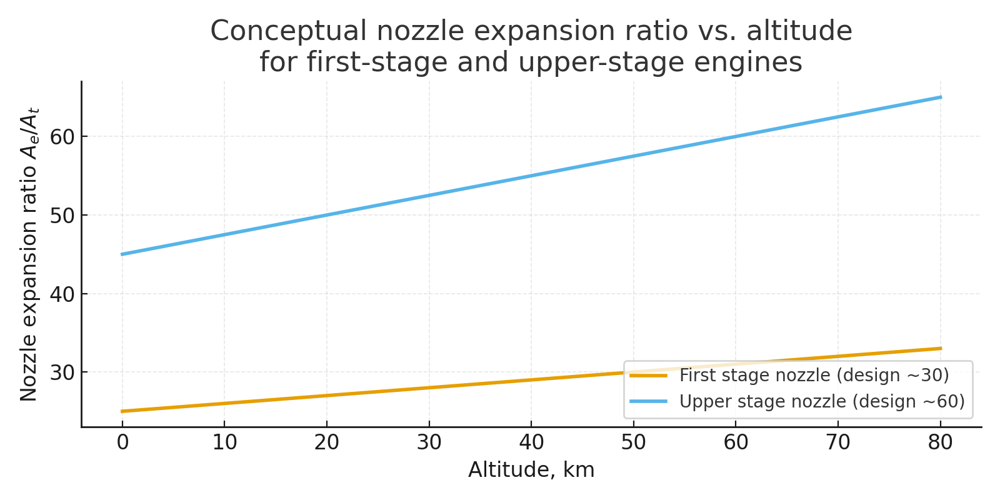
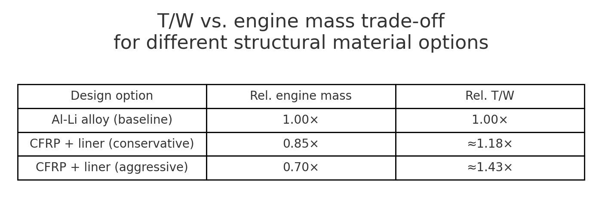
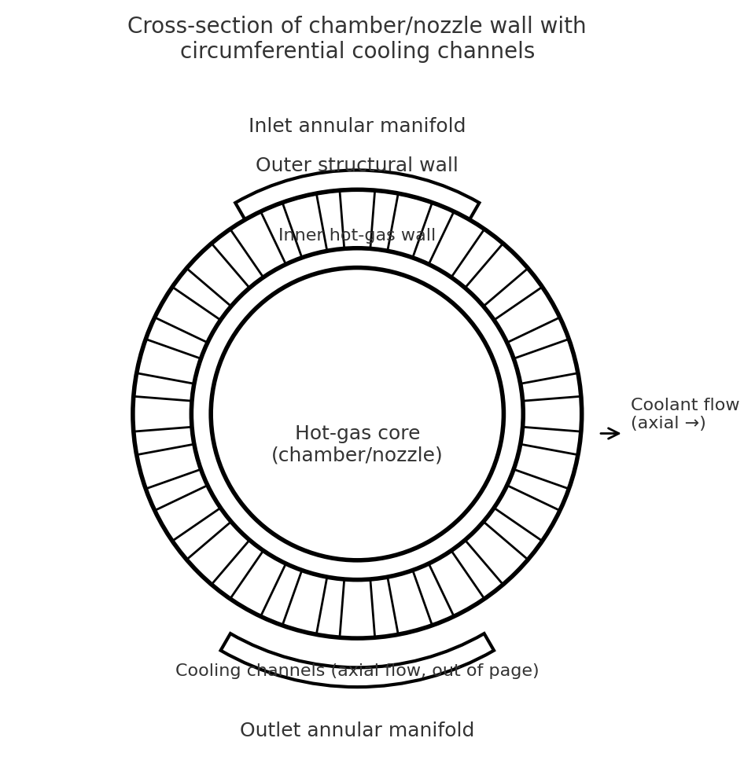

# Liquid-Propellant Rocket Engine Concept for Orbital Launch Vehicles

[](LICENSE)  
[](https://www.python.org/)  
[](https://github.com/your-username/your-repo)

## 📖 Overview  
This repository presents a conceptual design and analysis of a liquid-propellant rocket engine tailored for orbital launch vehicles. It covers key engine specifications (chamber pressure, nozzle expansion ratio, thrust-to-weight optimization), propellant and material choices (LOX/RP-1 and LOX/LH₂), cycle considerations, and supporting computational workflows (thermodynamic sizing, performance sweeps, trade-off studies).  
Suitable as a baseline for first or upper stage engine development with emphasis on high performance, manufacturability and system-level integration.

## 🏗 Project structure  

project-root/
├── docs/                        # design, parameters, material and cycle choice, references  
│   ├── overview.md  
│   ├── design_parameters.md  
│   ├── material_and_cycle_choice.md  
│   ├── specification.md  
│   ├── references.md  
│   └── optimization_tw.md  
├── figures/                     # engine schematics, plots, trade-off tables  
│   ├── engine_schematic.png  
│   ├── nozzle_expansion_ratio_plot.png  
│   ├── tw_vs_mass_tradeoff_table.png  
│   ├── chamber_nozzle_wall_cooling_channel_cross_section.png  
│   └── …  
├── calculations/                # scripts & notebooks for sizing and analysis  
│   ├── engine_sizing.py  
│   ├── tw_estimate.ipynb  
│   └── …  
├── notebooks/                   # additional interactive analyses  
├── src/                         # (optional) library modules if any  
├── .github/                     # GitHub configuration files  
│   ├── ISSUE_TEMPLATE/  
│   ├── CONTRIBUTING.md  
│   ├── CODE_OF_CONDUCT.md  
│   └── SECURITY.md  
├── config.yaml                  # configuration for sweeps & runs  
├── requirements.txt             # Python dependencies  
├── .gitignore  
├── CHANGELOG.md  
├── LICENSE  
└── README.md  


## 🎯 Key Specifications  
- Chamber pressure, Pc: ~20 MPa  
- Nozzle expansion ratio (Ae/At): ~30 (first stage) / ~60 (upper stage)  
- Thrust-to-weight ratio (T/W): ~80 N/kg  
- Propellants: LOX + RP-1 (1st stage) / LOX + LH₂ (upper stage)  
- Cycle: closed (e.g., staged combustion) or suitable high-performance design

## 🖼 Figures & Visuals  
  
  
  


Schematic diagram of the liquid-propellant rocket engine showing fuel & oxidiser tanks, turbopumps, combustion chamber, throat and bell nozzle.

## 🚀 Getting Started  
### Prerequisites  
- Python 3.7 or higher  
- Install dependencies:  
  ```bash
  pip install -r requirements.txt
Usage
Edit configuration in config.yaml (set pressure, O/F, Ae/At sweeps, etc).

Run sizing script:

bash

python calculations/engine_sizing.py
View generated figures in figures/, results in outputs/, logs in logs/, summaries in csv/.

Explore interactive notebook notebooks/tw_estimate.ipynb.

📄 Documentation
Detailed modules and analyses are located in docs/:

Overview

Design Parameters

Material & Cycle Choice

Specification

References

T/W Optimization

👥 Contributing
We welcome contributions! Please see CONTRIBUTING.md for guidelines, and review our Code of Conduct.
For reporting security issues, please see SECURITY.md.

📝 Changelog
Changes are documented in CHANGELOG.md using semantic versioning.

📇 License
This project is licensed under the MIT License.

🔗 Contact & Further Resources
Maintainer: SvetLuna­-Lab (GitHub profile)

LinkedIn: https://www.linkedin.com/in/svetlana-romanova-418596387

Research & reading references: see docs/references.md

Thank you for your interest and contributions. 🚀
